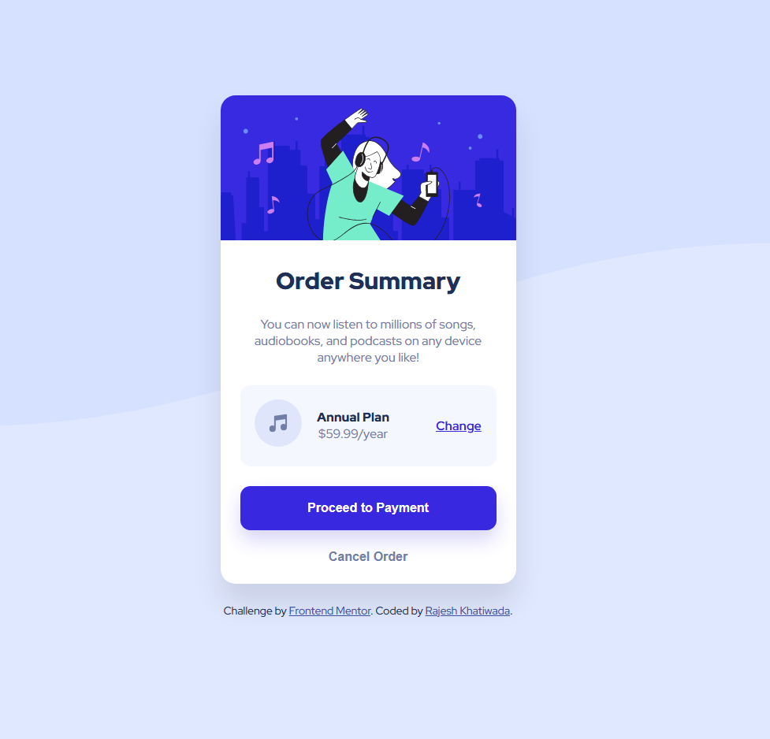

# Order Summary Component

A responsive order summary card built as part of the Frontend Mentor challenge.  
This project focuses on improving layout structure, spacing, and responsive UI design using HTML and CSS.

---

## 📸 Screenshot



---

## 🛠️ Built With

- HTML5
- CSS3
- Flexbox
- CSS Variables
- Responsive Design
- Mobile-first workflow

---

## 📌 Features

- Clean and modern card layout
- Responsive design for mobile and desktop screens
- Interactive hover states for buttons and links
- Well-structured pricing and summary section
- Pixel-perfect UI based on challenge design

---

## 📁 Project Structure


order-summary-component-main/
├── index.html
├── style.css
├── images/
│ └── (assets used in project)
├── screenshot.png
└── README.md


---

## 📖 What I Learned

While building this project, I practiced:

- Creating structured card layouts using Flexbox
- Managing spacing, alignment, and hierarchy
- Styling interactive elements with hover states
- Working with responsive design principles
- Translating a UI design into clean HTML/CSS

---

## 🚀 Future Improvements

- Add smooth animations for button interactions
- Improve accessibility (ARIA labels and semantic HTML)
- Convert into a reusable React component
- Add dark mode variation

---

## 👨‍💻 Author

- GitHub: [@KhatiwadaR](https://github.com/KhatiwadaR)
```
